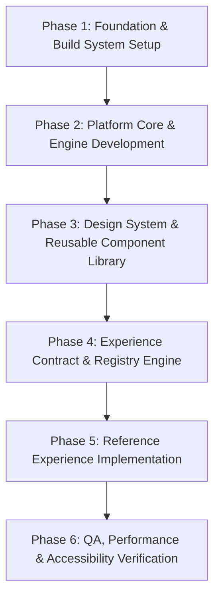

# Atlas Platform Migration Plan

**Version:** 1.0  
**Status:** Draft — Awaiting Approval  
**Target:** Evolution of Repository into the Atlas Interactive Science Platform  

---

## 1. Overview & Strategy

This document outlines the step-by-step migration blueprint for transforming the current repository into the **Atlas Platform**. It establishes a strict, phased progression designed to decouple platform infrastructure from scientific experience modules, ensuring zero technical debt, absolute role isolation, and non-negotiable adherence to the [Constitution](00_CONSTITUTION.md).

### Core Migration Principles
1. **Infrastructure First, Content Second:** Build the platform core, component library, registry, and contract runner before authoring any science experiences.
2. **Strict Boundary Enforcement:** Maintain clean separation between `src/platform/` and `src/experiences/` as specified in the [Platform Model](02_PLATFORM_MODEL.md).
3. **Role-Driven Ownership:** Every phase assigns primary ownership to specific [AI Roles](roles/). No role modifies code outside its domain boundary.
4. **Gate-Based Progression:** Each phase requires passing a dedicated verification gate before the next phase begins.

---

## 2. Phased Execution Blueprint



---

### Phase 1: Foundation & Workspace Initialization
* **Objective:** Establish repo architecture, package management, TypeScript configs, linting rules, and directory boundaries.
* **Lead Role:** [Platform Architect](roles/architect.md)
* **Supporting Roles:** [Integration Engineer](roles/integration-engineer.md)

#### Directory Structure Target
```text
Atlas/
├── .ai/                    # AI Entrypoint & Instructions
├── 00_CONSTITUTION.md      # Core Governance
├── 01_PLATFORM_VISION.md
├── 02_PLATFORM_MODEL.md
├── 03_DESIGN_LANGUAGE.md
├── 04_EXPERIENCE_PHILOSOPHY.md
├── 05_EXPERIENCE_CONTRACT.md
├── 06_QUALITY_BAR.md
├── 07_GLOSSARY.md
├── 08_ANTI_PATTERNS.md
├── 09_READING_ORDER.md
├── MIGRATION_PLAN.md       # Migration Blueprint
├── roles/                  # Role Definitions
└── src/
    ├── platform/           # Permanent Platform Architecture
    │   ├── core/           # State, Navigation, Router
    │   ├── registry/       # Global Experience Registry & Contracts
    │   ├── components/     # Reusable Design System Primitives
    │   ├── motion/         # Animation Curves & Spatial Physics
    │   └── theme/          # Design Tokens & Palette Definitions
    └── experiences/        # Isolated Science Experiences
        └── demo-concept/   # Reference Exhibit Implementation
```

#### Deliverables
- [ ] Initialize `package.json` with modern framework tooling (Vite / React or Next.js + Vanilla CSS / Tailwind tokens).
- [ ] Configure `tsconfig.json` with strict alias paths (`@platform/*` and `@experiences/*`).
- [ ] Setup repository linting & boundary protection scripts to prevent cross-imports between experiences.

#### Verification Gate 1
- `npm run build` succeeds with zero errors.
- Import boundary rule verified (experiences cannot import from other experiences).

---

### Phase 2: Platform Core & Engine Development
* **Objective:** Construct the underlying routing engine, state synchronizer, knowledge graph navigator, and spatial camera controller.
* **Lead Role:** [Platform Architect](roles/architect.md)
* **Supporting Roles:** [Integration Engineer](roles/integration-engineer.md)

#### Deliverables
- [ ] Build **Platform Router & Navigation Engine** (Graph-based navigation as detailed in [Platform Vision](01_PLATFORM_VISION.md)).
- [ ] Implement **Experience Runtime Manager** (Mounting/unmounting experience life-cycles dynamically).
- [ ] Create **Global Audio & Spatial Manager** for multi-sensory feedback loops.

#### Verification Gate 2
- Router cleanly loads/unloads mock experience nodes without memory leaks.
- Navigation transitions maintain physical spatial continuity without screen flashes.

---

### Phase 3: Design System & Reusable Component Library
* **Objective:** Build the foundational visual components and motion system compliant with [Design Language](03_DESIGN_LANGUAGE.md).
* **Lead Role:** [Interface Designer](roles/ui-designer.md)
* **Supporting Roles:** [Motion Designer](roles/motion-designer.md), [Accessibility Specialist](roles/accessibility-specialist.md)

#### Deliverables
- [ ] **Design Tokens Engine:** CSS variables for color, typography, spacing, depth, and glassmorphism.
- [ ] **Core Components:** `HeroCanvas`, `ExplorerControls`, `KnowledgeCard`, `TimelineNav`, `ComparisonViewport`, `LabSandbox`.
- [ ] **Motion Curves Library:** Standardized spring physics and timing curves (Elegance, Spatial, Physical).

#### Verification Gate 3
- All UI components pass WCAG 2.1 AA accessibility checks.
- Zero decorative-only animations exist; motion responds to user interaction within 16ms.

---

### Phase 4: Experience Contract & Registry Engine
* **Objective:** Formalize the TypeScript interfaces and validation layer defined in the [Experience Contract](05_EXPERIENCE_CONTRACT.md).
* **Lead Role:** [Integration Engineer](roles/integration-engineer.md)
* **Supporting Roles:** [Platform Architect](roles/architect.md)

#### Deliverables
- [ ] Define `AtlasExperience` interface schema (Metadata, 7-Scene Lifecycle, Capabilities, Scene Flow).
- [ ] Implement **Experience Registry**: Dynamic registration system for scanning and loading valid modules.
- [ ] Implement **Pre-flight Contract Validator**: Automated verification of experience metadata and scene structures.

#### Verification Gate 4
- Invalid or malformed experience modules are rejected by the registry with clear error diagnostics.

---

### Phase 5: Reference Experience Implementation
* **Objective:** Construct the first flagship science exhibit to demonstrate the end-to-end capabilities of Atlas.
* **Lead Role:** [Experience Architect](roles/experience-architect.md)
* **Supporting Roles:** [Scientific Reviewer](roles/scientific-reviewer.md), [Curator](roles/curator.md)

#### Deliverables
- [ ] Author **Reference Exhibit** following the 7-scene structure: Arrival → Orientation → Observation → Interaction → Experiment → Challenge → Reflection.
- [ ] Conduct Scientific Audit using [Scientific Reviewer](roles/scientific-reviewer.md) parameters.
- [ ] Conduct Editorial & Wonder Audit via [Curator](roles/curator.md).

#### Verification Gate 5
- Passes the "What happens if..." test on every interactive element.
- Zero blocks of un-interactive textbook text.

---

### Phase 6: QA, Performance & Accessibility Audit
* **Objective:** Subject the platform and reference exhibit to rigorous verification against the [Quality Bar](06_QUALITY_BAR.md).
* **Lead Role:** [Quality Engineer](roles/qa.md)
* **Supporting Roles:** [Performance Engineer](roles/performance-engineer.md), [Accessibility Specialist](roles/accessibility-specialist.md)

#### Deliverables
- [ ] **Performance Audit:** 60fps rendering budget during interactions, sub-second initial load times.
- [ ] **Accessibility Audit:** Full keyboard navigation, screen reader accessibility, reduced motion mode.
- [ ] **Quality Bar Review:** Pass 100% of the self-audit checklist in [Quality Bar](06_QUALITY_BAR.md).

#### Verification Gate 6
- Zero blocking bugs, performance frame drops, or accessibility compliance failures.

---

## 3. Summary Matrix & Role Assignment

| Migration Phase | Lead Role | Primary Deliverable | Target Artifact |
|---|---|---|---|
| **Phase 1: Foundation** | Platform Architect | Build System & Folder Structure | Configs & Boundary Rules |
| **Phase 2: Platform Core** | Platform Architect | Router, Registry & Runtime | Platform Engine |
| **Phase 3: Design System** | Interface Designer | UI Components & Motion Library | Component System |
| **Phase 4: Experience Contract** | Integration Engineer | Module Interface & Validator | Contract Schema |
| **Phase 5: Reference Exhibit** | Experience Architect | Flagship Interactive Exhibit | Sample Experience |
| **Phase 6: Quality Verification** | Quality Engineer | Complete Platform Audit | Audit Sign-off |

---

## 4. Next Steps & Approval Workflow

1. **User Review:** Review and approve this `MIGRATION_PLAN.md`.
2. **Phase 1 Initiation:** Upon approval, launch Phase 1 initialization.
3. **Continuous Alignment:** Re-verify all build steps against the [Constitution](00_CONSTITUTION.md).

---

> **Atlas Navigation** · [00 Constitution](00_CONSTITUTION.md) · [01 Platform Vision](01_PLATFORM_VISION.md) · [02 Platform Model](02_PLATFORM_MODEL.md) · [03 Design Language](03_DESIGN_LANGUAGE.md) · [04 Experience Philosophy](04_EXPERIENCE_PHILOSOPHY.md) · [05 Experience Contract](05_EXPERIENCE_CONTRACT.md) · [06 Quality Bar](06_QUALITY_BAR.md) · [07 Glossary](07_GLOSSARY.md) · [08 Anti-Patterns](08_ANTI_PATTERNS.md) · [09 Reading Order](09_READING_ORDER.md) · [Roles →](roles/)
